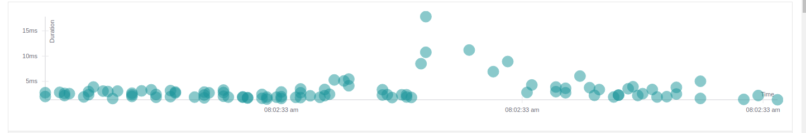
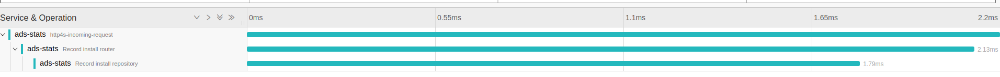
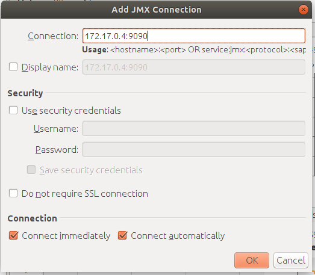
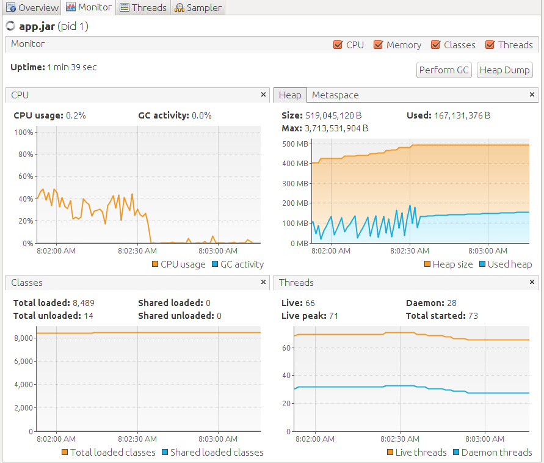

# ads-stats
An HTTP Server, packaged with postgres, jaegar and perf-test module in a docker, to record ad deliveries, clicks and installs, and query the statistics. 

# Tech stack
`Scala` as language <br>
`Http4s` as server <br>
`Postgres` as database <br>
`doobie` as jdbc layer for scala <br>
`circe` for json encoding and decoding <br>
`flywaydb` for database migrations <br>
`scala open tracing` for tracing context <br>
`jaegar` as the tracer<br>
`docker` - The application is dockerized along with `postgres` and `jaegar` <br>
`scalacheck` - Generators are used to generate payload for perf-test

# Overview
- Whenever an ad is loaded on a site, it is captured as a `delivery`.
- User clicking on the ad is captured as a `click`. Click contains the `delivery_id` that lead to the click.
- When the `click` leads to an install, it is captured as `install`. An `install` contains the `click_id` that lead to the install.
- Querying the stats is time based and/or category based (You can query stats grouped by `OS` and `Browser`)
- Sample curls for every request is present in the `curls` directory
- The project also contains a sub-project called `perf-test` which bombards the application server with requests (according to the parameters passed)
- The `docker-compose.yml` has the application server, postgres, jaegar-all-in-one and the perf-test-app. 

# Setup & Run
- `make setup_server` builds a fat jar out of the server (ads-stats).
- `make setup_perf_test` builds a fat jar out of the `perf-test` sub project.
- `make run_server` packages `postgres`, `jaegar` and `ads-stats-app`(server) into a docker container and expose `127.0.0.1:8080` to the outside world.
- `make perf_test_time_travel` runs `ads-stats-app` with `no-op-tracer` and runs the `perf-test` with the arguments supplied. Use this to pre-populate your database with data while without tracing it. Eg: `make perf_test_time_travel deliveries=500 delivery_to_click_ratio=0.5 click_to_install_ratio=0.5`. This will insert `500` deliveries, and clicks and installs will be inserted according to the ratio specified. Note that you will not be able to see any traces in the `jaegar` dashboard after you run the test.
- `make perf_test` runs `ads-stats` with a valid tracer and the traces will show up on the `jaegar` dashboard. Eg: `make perf_test delivery_to_click_ratio=0.5 click_to_install_ratio=0.5 delivery_to_query_ratio=0.25 running_time_in_seconds=50`. This will run the perf-test for 50 seconds and during this time the inserts will happen in the ratio specified.


# Tracing

You can see the traces by going to `http://localhost:16686/` on your browser. Select `ads-stats-app` service and then you can see the traced requests. 


<br><br>



# JVM Profiling

The `ads-stats-app` server is started with the these properties

```
-Dcom.sun.management.jmxremote.rmi.port=9090 -Dcom.sun.management.jmxremote=true -Dcom.sun.management.jmxremote.port=9090 -Dcom.sun.management.jmxremote.ssl=false -Dcom.sun.management.jmxremote.authenticate=false -Djava.rmi.server.hostname=127.0.0.1 -Dcom.sun.management.jmxremote.local.only=false
```

This allows you to monitor the JVM from your localmachine, say using VisualVM. Open Visual VM -> Remote -> Add Remote Host. Here add the IP Address of `ads-stats-app`. You can find the ip-address by running this command:
```
docker inspect -f '{{range .NetworkSettings.Networks}}{{.IPAddress}}{{end}}' <container-id-of-ads-stats-app>
```
After adding the IP address, right click on the IP address and click `Add JMX Connection`. A window similar to the one below should show up. Add the port `9090` to the IP address and click Ok (in my machine `172.17.0.4` happened to be the IP address of `ads-stats-app`).



You should be able to monitor the app now.


